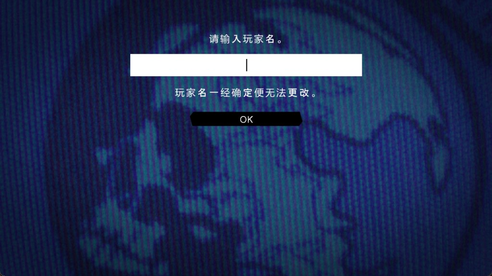

# 01 · olang (RBX) 文本表 —— UI 文字提取

目标二进制：`METAL GEAR SOLID PEACE WALKER.exe`
```
base 0x140000000  size 0x1964000  md5 5bfe6b2cdbb77c3f0f3cff05fcad22bd
sha256 5bc5756166e611d7f15e84e8032ac417771a9633d8cc072dab20a7613e588fff
```

---

## 1. 磁盘布局

游戏目录 `mgspw\` 下有两套**并行**的语言包，目录名即语言槽位：

| 目录 | 含义 | 说明 |
|---|---|---|
| `MLG\` | Multi-Language Game | `en/fr/de/it/es/ja` 六语言包（本机安装版实际目录） |
| `EXLANG\` | EXternal LANGuage | **葡萄牙语**包（见 §5） |
| `JPN\` | 日文包 | 路径在二进制中存在（`.rdata`），本机安装版**未提供** |

```
MLG\Text\*.olang        14 个   ← UI 文本表
MLG\data\00170a6e.bin
MLG\data\Mov\*.xmx/.xsx          ← 影片 / 字幕（见 02 号文档）
MLG\disc0_rel\*.DAT/.PDT/.KEY    ← 游戏主体数据（SLOT.DAT / STAGEDAT.PDT 等）
EXLANG\Text\*.olang      3 个
EXLANG\data\*.bin, Mov\*.xmx/.xsx
FONT\*.xpr              字体
Text\*.txp              字形贴图
ms0\EU\DLC{BGM,TEX,VOICE}\*.PDT
```

---

## 2. 语言选择逻辑

### 2.1 `lang_get_language_id` @ `0x140027B40`

读取 `g_launcher_config[13]`（`0x1415FB1F8`）指向的语言码字符串，返回语言序号：

| 前缀 | 返回值 |
|---|---|
| *(空指针)* | 6 |
| `en` | 0 |
| `fr` | 1 |
| `sp` | 4 |
| `gr` | 2 |
| `it` | 3 |
| `jp` | 6 |
| `pt` | **4**（与 `sp` 相同！） |
| 其它 | 6 |

> 注意：`pt` 与 `sp` 序号相同，葡萄牙语靠**切换 olang 文件**（`EXLANG\`）而非靠序号区分。
> `lang_is_portuguese_pt` @ `0x140027C70` 独立判定 `!strncmp(lang,"pt",2)`。
> `lang_is_japanese` @ `0x140027C50`。

### 2.2 `get_olang_lang_id` @ `0x1401093A0`

序号 → **olang 语言键**（表在 `0x1409BD4B0` + 栈上 3 项，共 7 项）：

| 序号 | 语言键 | 语言 |
|---|---|---|
| 0 | `0x0D0E` | en |
| 1 | `0x0D32` | fr |
| 2 | `0x0D45` | de (`gr`) |
| 3 | `0x0D94` | it |
| 4 | `0x0ED0` | es **以及 pt** |
| 5 | `0x0DD2` | *（未由 `lang_get_language_id` 产生）* |
| 6 | `0x0DB0` | ja |
| ≥7 | `0x0D0E` | 回退 en |

汇编佐证（`0x1401093BB`–`0x1401093CB`）：
```
mov [rsp+38h+var_28], 0ED0h
mov [rsp+38h+var_24], 0DD2h
mov [rsp+38h+var_20], 0DB0h
movdqu [rsp+38h+var_38], xmm0   ; xmm0 = g_lang_id_table = {0D0Eh,0D32h,0D45h,0D94h}
```

### 2.3 `textlang_resolve_olang_paths` @ `0x1400859B0`

构造两个全局 `std::vector<std::string>`：
- `g_olang_text_paths`      @ `0x1410C29C8`
- `g_olang_base_text_paths` @ `0x1410C29E0`

指针表 `0x140990770`（每项 8 字节，指向 0x20 字节的路径串）：

| 指针地址 | 目标 | 路径 |
|---|---|---|
| `0x140990770` | `0x1409907A8` | `./JPN/Text/007e2f18.olang` |
| `0x140990778` | `0x1409907C8` | `./MLG/Text/009c9ea4.olang` |
| `0x140990780` | `0x1409907E8` | `./EXLANG/Text/00c7f1dc.olang` |
| `0x140990788` | `0x140990808` | `./EXLANG/Text/00c7f1dd.olang` |
| `0x140990790` | `0x140990828` | `./JPN/Text/00225520.olang` |
| `0x140990798` | `0x140990848` | `./MLG/Text/00d9bfd4.olang` |
| `0x1409907A0` | `0x140990868` | `./EXLANG/Text/0077040c.olang` |

结果：

| 语言 | `g_olang_base_text_paths` | `g_olang_text_paths` |
|---|---|---|
| ja (6) | `JPN/Text/00225520.olang` | `JPN/Text/007e2f18.olang` |
| en/fr/de/it/es | `MLG/Text/00d9bfd4.olang` | `MLG/Text/009c9ea4.olang` |
| pt | `EXLANG/Text/0077040c.olang` | `EXLANG/Text/00c7f1dc.olang` + `EXLANG/Text/00c7f1dd.olang` |

> `00c7f1dd.olang` 只在 **pt** 下被请求。它是 321 组 × 平均 30 条 的**对话型**表
> （`EXLANG\Text\00c7f1dd.olang`，meta 分布 `{0x402: 48486, 0x1: 9306}`），
> 与 UI 型的 `00c7f1dc`（1321 组 × ~7.6 条）形态不同。

---

## 3. 文件加密

### 3.1 密钥派生 `name_hash` @ `0x14010F450`

伪码（已实证）：
```c
uint32 name_hash(const char *p) {
    // 1) 取 basename：最后一个 '/'(0x2F) ':' (0x3A) '\\' (0x5C) 之后
    //    位图 0x200000000801 的 bit(c-47) 置位者为分隔符
    size_t start = 最后一个分隔符下标 + 1;   // 无分隔符则为 0
    // 2) 从 start 起，遇到 '.' 或 '\0' 停止
    uint32 h = 0;
    for (c = p[start]; c && c != '.'; ++start, c = p[start])
        h = 7477 * c + 144751 * h;          // mod 2^32
    return h;
}
```

**调用点证据** `olang_register_table` @ `0x14003ADD0`：
```c
v42[0] = *v41;                       // 表 id（记录中 offset 128 处的 u32）
v42[1] = name_hash(v29);             // v29 = 记录起始处的 char[128] 名称
file_request_async(path, olang_load_decrypt_and_install, v42, 0, 16, 1);
```
其中 `path = (lang_id==6 ? "JPN/Text/" : "MLG/Text/") + 名称 + ".olang"`，
记录步长 132 字节 = `char name[128]; u32 id;`。

> 因为 `name_hash` 只取 basename，所以 `name_hash("009c9ea4")`
> == `name_hash("./MLG/Text/009c9ea4.olang")`，两者等价（已验证）。

### 3.2 解密 `buffer_xor_decrypt` @ `0x14010F4C0`

```
state = mt_alloc(0x1388 字节, seed = key)      ; 0x14010ED00，末附 mt_seed
mt_advance(state, 20)                          ; 0x14010ED90
for i in 0 .. size/4:
    buf32[i] ^= mt_next(state) ^ 0xB9D3018F    ; 0x14010ED60
余下 size&3 字节：取下一个 keystream dword，逐字节异或后右移 8
```

MT19937 状态布局（`mt_alloc` 分配 `0x1388` = 1250 × u32）：
```
[0]       index
[1..624]  mt[0..623]
[625]     mt[624]  (== mt[0]，绕回哨兵)
[626..]   624 个预先 temper 好的输出，供 mt_next 顺序消费
```

- **tempering** 即标准 MT19937，掩码取自
  `0x1409BD930 = 0xFF3A58AD`（等价于 `0x9D2C5680 >> 7`，保留 `<<7` 后未溢出的位）、
  `0x1409BD940 = 0xFFFFDF8C`（等价于 `0xEFC60000 >> 15`）。
- **mag01** @ `0x140F4C7C0` = `{0, 0x9908B0DF}`（标准）。
- **唯一非标准处是播种** `mt_seed` @ `0x14010F000`，用 LCG 代替 `init_genrand`：
  ```c
  x = seed;
  for (i = 0; i < 624; ++i) {
      y = 69069 * x + 1;                       // mod 2^32
      mt[i] = (x & 0xFFFF0000) | (y >> 16);
      x = 69069 * y + 1;                       // mod 2^32
  }
  ```
  随后立即执行一次完整 twist + 批量 temper。
- **`mt_advance(state, 20)` 实际只跳过 5 个输出**：
  ```
  v3 = (a2 + 4*index) >> 2  →  (20 + 0)>>2 = 5
  ```
  即 index 直接置 5（< 624，不触发 twist）。这是编译器对“按字节计数”参数的
  真实产物，复现时必须照抄。

---

## 4. 容器格式（RBX）

`olang_load_decrypt_and_install` @ `0x14003AD90` 先 `buffer_xor_decrypt`，
再 `olang_install` @ `0x1400E72C0`（写入 `g_olang_slots`，
`0x14121C020`~`0x14121C160`，20 槽 × 16 字节 = `{u32 id; void* buf}`）。

解密后首 4 字节为 `52 42 58 00` = **`"RBX\0"`**。

```
偏移  类型    字段
0x00  char[4] magic   'R','B','X',0
0x04  u32     table_id         == 文件名十六进制部分（如 009c9ea4.olang → 0x009C9EA4）
0x08  u32     0
0x0C  u16     0
0x0E  u16     group_count
0x10  u32     off_group_table  （恒为 0x20，紧跟头部）
0x14  u32     off_entry_table
0x18  u32     off_key_table
0x1C  u32     off_string_pool
0x20  ...     group[group_count]
```

三级索引（8 / 8 / 12 字节）：
```
group[i] : u32 key;  u16 entry_start; u16 entry_count;      // 8
entry[i] : u32 key;  u16 key_start;   u16 key_count;        // 8
key[i]   : u32 key;  u32 str_off;     u16 meta; u16 pad;    // 12
```
字符串地址 = `base + off_string_pool + str_off`，**NUL 结尾、UTF-8**。

### 4.1 查找算法 `text_lookup` @ `0x1400E6EB0`

```
text_lookup(group_key, entry_key, lang_key, &out_meta, &out_str)
  1. 在 group[] 中线性查找 key == group_key
  2. 取该 group 覆盖的 entry[] 区间，线性查找 key == entry_key
  3. 取该 entry 覆盖的 key[] 区间，线性查找 key == lang_key
  4. *out_meta = key_entry.meta;  *out_str = pool_base + key_entry.str_off
```
查找顺序（overlay 语义，先命中者胜）：
1. `g_olang_base_text_paths` 注册的表（若 `sub_140027DD0()` 为假）
2. `g_olang_text_paths` 注册的表
3. `g_olang_slots`  `0x14121C020`（由 `SYSTEM.DAT` 等注册）
4. `g_resource_slots` `0x14121B018`（256 槽资源表，`resource_lookup_by_hash` @ `0x140099BB0`）

`text_get` @ `0x1400E6990` 是其薄封装：失败时把 `*out` 置为 `off_140F1B828`（空串）。

### 4.2 字符串内嵌标记

文本中出现形如 `<I=item_exp_IT_EQ_LOVE_CBOARD_R1>`、`<I=DEC>`、`<I=AIM>` 的
**内联图标/按键引用**，另有 `%d` 一类格式符。提取/回写时必须原样保留。

**换行是真实 `0x0A`，不是字面的两字符 `\` `n`**（此前本节记反了）。
`_probe_olang4.py` 扫全部 137,358 条字符串的池内原始字节：

```
含 0x0A            4,289 条
含字面反斜杠-n         0 条
含 0x0D              181 条
```

误判来源是 `_probe_dump.py` 会把真实换行转义成 `\n` 再写进 TSV，
只看 `_dump_olang.tsv` 分辨不出二者。

---

## 5. 实测结果

用 `pwsf.crypto` + `pwsf.olang` 解密本机全部 17 个 olang 文件，
**全部通过 `RBX\0` 魔数与三表偏移自洽校验**：

| 文件 | table_id | groups | entries | keys | pool | 语言键 |
|---|---|---:|---:|---:|---:|---|
| `MLG/Text/0005ee2f.olang` | 0x5ee2f | 1 | 40 | 246 | 5454 | 6 × 41 |
| `MLG/Text/00327f6a.olang` | 0x327f6a | 2 | 4 | 24 | 1818 | 6 × 4 |
| `MLG/Text/0043da6e.olang` | 0x43da6e | 2 | 22 | 132 | 8812 | 6 × 22 |
| `MLG/Text/005184e3.olang` | 0x5184e3 | 108 | 204 | 1254 | 53276 | 6 × 209 |
| `MLG/Text/0060e2f2.olang` | 0x60e2f2 | 1 | 27 | 162 | 4594 | 6 × 27 |
| `MLG/Text/0066e64e.olang` | 0x66e64e | 29 | 487 | 2922 | 8952 | 6 × 487 |
| `MLG/Text/0072f326.olang` | 0x72f326 | 3 | 44 | 264 | 24022 | 6 × 44 |
| `MLG/Text/009c9ea4.olang` | 0x9c9ea4 | 221 | 1957 | 11742 | 240018 | 6 × 1957 |
| `MLG/Text/00c6a046.olang` | 0xc6a046 | 4 | 8 | 48 | 1936 | 6 × 8 |
| `MLG/Text/00cb1fb7.olang` | 0xcb1fb7 | 2 | 115 | 696 | 24760 | 6 × 116 |
| `MLG/Text/00cd740b.olang` | 0xcd740b | 19 | 30 | 186 | 11698 | 6 × 31 |
| `MLG/Text/00d0c740.olang` | 0xd0c740 | 9 | 68 | 408 | 26554 | 6 × 68 |
| `MLG/Text/00d345a5.olang` | 0xd345a5 | 8 | 77 | 462 | 40894 | 6 × 77 |
| `MLG/Text/00d9bfd4.olang` | 0xd9bfd4 | 22 | 55 | 330 | 21934 | 6 × 55 |
| `EXLANG/Text/0077040c.olang` | 0x77040c | 22 | 55 | 330 | 3886 | 6 × 55 |
| `EXLANG/Text/00c7f1dc.olang` | 0xc7f1dc | 1321 | 9994 | 60360 | 315010 | 6 × 10060 |
| `EXLANG/Text/00c7f1dd.olang` | 0xc7f1dd | 321 | 9632 | 57792 | 251928 | 6 × 9632 |

**每个文件都恰好含 6 个语言键**：`0x0D0E/en 0x0D32/fr 0x0D45/de 0x0D94/it 0x0DB0/ja 0x0ED0/es`。

### 5.1 葡萄牙语占用西班牙语槽（关键）

`EXLANG/Text/00c7f1dc.olang` 的 `0x0ED0` 槽内容为葡萄牙语：
```
(0x21535e, 0xae8886) es → "Chamada de Codec"        （葡语：Codec 通话）
(0x2c4b0f, 0x3311ec) es → "CHAMADA DE CODEC"
(0x101ab9, 0x1c117e) es → "Dispositivo de Saída do Codec de Entrada"
```
与 `lang_get_language_id("pt") == 4 → 0x0ED0` 完全吻合。
**做本土化时：要替换 pt 文本就写 `EXLANG\Text\*.olang` 的 `0x0ED0` 键；
替换 es 文本则写 `MLG\Text\*.olang` 的 `0x0ED0` 键。二者互不干扰。**

`MLG/Text/00d9bfd4.olang` 与 `EXLANG/Text/0077040c.olang` 的**结构逐字节相同**
（同为 22 组 / 55 条 / 330 键，group 表完全相同），仅字符串池不同
（21934 vs 3886 字节）——即同一套 UI 的两种语言数据。

### 5.2 CODEC 文本确实在 olang 内

`MLG/Text/009c9ea4.olang` 中 `Codec Call`（`Appel Codec` / `Codec-Anruf` /
`Chiamata Codec` / `Llamada de Codec`）存在；`EXLANG/Text/00c7f1dd.olang`
的**条目键**可反查出说话人：`SNAKE` `MILLER` `AMANDA` `CHICO` `GALVEZ`
`CECILE` `STLOVE`（见 §6）。

---

## 6. 键名的哈希反查

`str_hash24` @ `0x14011F780`（24 位滚动哈希，`sub_14004ECD0` 对普通名称返回 5，
不触发 `sub_14004F1E0` 预处理）：
```c
h = 0;
for (c in s) h = (ROTL24(h, 5) + c) & 0xFFFFFF;   // ROTL24(x,5) = ((x<<5)|(x>>19)) & 0xFFFFFF
if (h == 0) h = 1;
```
对二进制内 49869 个字符串做反查，9461 个键中**命中 141 个**，例如：

```
SNAKE  MILLER  AMANDA  CHICO  GALVEZ  CECILE  STLOVE
NAME_M134  NAME_GS_SHOTGUN  NAME_MOTOSWAT  NAME_BIRDER  TAG_MALE  TAG_FEMALE
pw_briefing_topic  pw_common  pw_cmn_menu_hyphen  pw_cmn_menu_blank
INFO_VOCALID_PART_01..07  INFO_VOCALID_TIMING_01..17
NETWORK_ERROR_*  GNK_*  INVITE_FAIL_*
```

剩余 9320 个键的名字**不在二进制字符串表中**（应为构建期预计算哈希），
本土化可用十六进制哈希作为稳定 ID，无需还原名字。

> `entry_name_hash` @ `0x14011F820` 是**另一套**（用于归档文件系统）：
> 同为滚动哈希但在 `.` 处停止，并把扩展名在 `g_ext_id_table` @ `0x140F4C7D0`
> 查得的 id 或到高 8 位。**不要**与 `str_hash24` 混淆。

---

## 6.5 回写（序列化器）—— 已打通

`pwsf.olang_build`。为写它先实测了序列化必须守住的不变量
（`_probe_olang2.py`，17 个表全覆盖）：

```
header 0x20 字节，其后 group / entry / key / pool 四段紧邻，段间零填充
header +0x08 的 u32 与 +0x0C 的 u16 恒为 0
table_id 恒等于文件名的十六进制部分
key.meta 只取 1 或 0x402；key.pad 恒为 0
字符串池有去重（相同字符串共用一个 str_off）
池内存在不可达字节（死空隙），可安全丢弃
```

因为 `text_lookup` 三级**全是线性扫描**（§4.1），任何一级都不要求有序，
所以重发时保持原序即可，将来增删条目也不受排序约束。

两种输出模式与校验（`_probe_olang3.py`，17/17 通过）：

| 模式 | 语义 | 校验 |
|---|---|---|
| `serialize_exact()` | 沿用原 `str_off`，池逐字节照搬 | **与原文件字节一致** |
| `serialize()` | 重排去重后的新池 | 重新解析后逐三元组字符串一致 |

重排模式会顺带丢掉死空隙，因此文件略微变小，且**减少量与 `_probe_olang2.py`
实测的空隙字节数逐个吻合**（例如 `009c9ea4` 减 2,820 字节）——这既是序列化
正确的旁证，也说明空隙确实无人引用。

### 6.6 端到端实机验证

`TOOLS/_poc_text_cn.py` 改写 `009c9ea4.olang` 中 group `0x9B86AB` 的 8 条
英文槽文本，同时用 `pwsf_font_build.py` 按译文码点自动补齐缺失字形
（需要 57 个码点，现役字体已有 25 个，补了 32 个）：



校验器确认：8 条改对、其余 11,734 条一字未动、`%d` 格式符保留、
每个码点都有非空字形。这一张图证明了文本侧的全部环节——
池重排后的 `str_off`、三表偏移、重新加密、以及 `text_lookup` 的三级查找
在改写后依然自洽。

## 7. 待办 / 未决

- [x] ~~`key[].meta`（`0x402` / `0x1`）语义未定~~ —— **已定：meta 是字体选择器**。
      `0x1` = `Text\*.txp` 里那张 512×512 BC3 像素字图集（只有 ASCII + Latin-1，
      一个汉字都没有）；`0x402` = `FONT\*.xpr` 的 ATG 字体。证据链见
      `05_font.md` §15：RenderDoc 抓帧里 "PRESS START BUTTON"（`005184e3`
      槽 `0xfb5d7b`，meta 0x1）的 14 个 quad 全部采样那张像素图集，而同一帧
      4096×4096 的 ATG 图集根本不在显存里。
      原记录"多数文件 meta 按 group 恒定、`009c9ea4` 有 9 个 group 内部混用"
      仍然成立 —— meta 是 **per-key** 的，所以管线一律以**英文键**的 meta 为准
      （`slots.META_PIXEL_FONT`）。

      > 遗留：`0x402` → ATG 字体目前是推论（那批文本有汉字，而只有 ATG 字体有
      > 汉字），需要在有 0x402 长文本的界面再抓一帧确认 4096×4096 被绑定。
- [ ] 运行时如何加载 `MLG\Text\` 下其余 12 个表（`textlang_resolve_olang_paths`
      只注册了 2 个）。线索：`olang_register_table` @ `0x14003ADD0` 由
      `sub_140076AA0` 调用，表名来自 132 字节/项的记录表；
      `systemdat_parse_text_name` @ `0x1401BE230` 只接受**长度恰为 15** 的名字，
      推测该记录表来自 `SYSTEM.DAT`（`JP_SYSTEM.DAT` / `EU_SYSTEM.DAT` @ `0x1409C42F0`，
      位于 `disc0_rel\002aba34.DAT` 内）。**未验证。**
- [ ] 回写（rebuild）流程未实现：需重排字符串池并重算三表偏移与 `str_off`。

---

## 8. 复现命令

```powershell
cd d:\PWSF\research\TOOLS
python _probe_dump.py     # 导出 137358 行 → ANALYSIS\_dump_olang.tsv
python _probe_keys.py     # 各文件语言键分布
python _probe_mkkeys.py   # 生成 ANALYSIS\_keys.txt 供哈希反查
```
