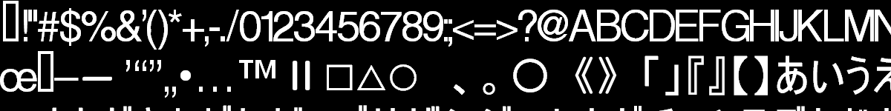
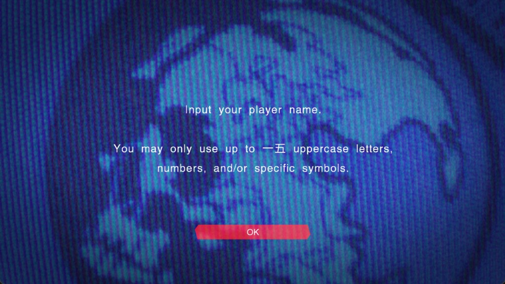
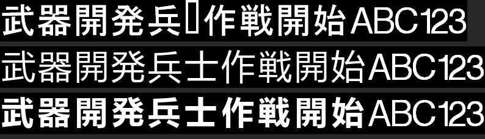

# 05 · 字体（FONT/*.xpr）与 UI 贴图包（Text/*.txp）

结论先行：**字体可扩，且不需要 hook 渲染器。** 字形查找按 Unicode BMP 码点
走一张 `cMaxGlyph = 0xFF5E` 的转换表，表本身已经按全 BMP 尺寸随包发布；
主字体图集 4096×4096 只用到第 612 行，**剩约 51 行空白，够塞 ~3,100 个全角汉字**。
整张字库也可以推倒重做（容量 ~4,140，约束与代价见 §12）。

---

## 1. 两个字体包，按语言选择

`font_init_load_all` @ `0x140043410`：

```c
v0 = "0007ccd8.xpr"; v1 = "000ebbe8.xpr";
if (lang_get_language_id() == 6) {          // 日语
    v0 = "00c7c9f9.xpr"; v1 = "001cbbd1.xpr";
}
font_load_xpr(&g_font_large, v0, 4096);
font_load_xpr(&g_font_small, v1, 2048);
```

| 逻辑 | 文件 | 磁盘 | 字体对象 |
|---|---|---|---|
| 默认（欧美） | `FONT\0007ccd8.xpr` | ✅ 16,918,556 B | `g_font_large` @ `0x141061A18` |
| 默认（欧美） | `FONT\000ebbe8.xpr` | ✅ 2,236,444 B | `g_font_small` @ `0x141061AB0` |
| 日语 | `FONT\00c7c9f9.xpr` | ❌ 未随包发布 | — |
| 日语 | `FONT\001cbbd1.xpr` | ❌ 未随包发布 | — |

两个字体对象间距 152 字节，`dword_141061A0C` 选当前字体。

> 日语字体不在 Steam 版里，和 `path_resolve_install` 把 `lang_id == 6` 指向
> `/JPN/disc0_rel`（该目录同样不存在）是一致的——**Steam 版根本走不到日语分支**。
> olang 里的 ja 文本是随包带着的死数据。

**这就是全部的字形图集，没有第三种。** 两条独立证据：

1. `xpr_package_load` @ `0x140042630` 在整个映像里**只有一个调用点**
   ——`font_load_xpr` @ `0x140042DB0`。除字体外没有任何模块读 XPR2。
2. 二进制里的 `.xpr` 文件名只有 4 个字符串（`0x140DA9860` 起，两两相邻）：
   `000ebbe8` / `00c7c9f9` / `0007ccd8` / `001cbbd1`，即上面这张表。

所以标题、logo、开场字幕看起来"像另一种字体"，不会是第三个 ATG 字体：要么仍是
这两个里的一个（被放大绘制），要么是贴图（`Text/*.txp`，§5）。区分方法见 §13.7。

## 2. XPR2 容器

`xpr_package_load` @ `0x140042630`，全大端：

```
+0   'XPR2'          汇编里比较的是 1481658930 = 0x58505232
+4   u32 header_size
+8   u32 data_size
+12  header 块（header_size 字节）
     +0  u32 资源数
     +4  目录，24 字节/项：
           +0  u32 类型标签 'TX2D' / 'USER'
           +4  u32 偏移（指向 header 块内，**不是** data 块）
           +8  u32 大小
           +16 u32 名字偏移（加载时低 dword 字节序翻转后加上 header 基址）
     data 块（data_size 字节）
```

`12 + header_size + data_size == 文件大小`，两个文件都精确吻合。

加密与 olang 同一套：`name_hash(路径)` 播种，**头 12 字节、header 块、data 块
共用一条连续 MT 密钥流**（`sub_14010F8B0` 播种后连续三次
`sub_14010F5C0`），所以用一次性的 `buffer_xor_decrypt` 整文件解即可。

实测两个包都是 2 个资源：

| 文件 | header | data | 资源 |
|---|---|---|---|
| `0007ccd8.xpr` | `0x22810` | `0x1000000` | `FontTexture`(TX2D, off `0x50`, 52 B) / `FontData`(USER, off `0x84`, `0x22708` B) |
| `000ebbe8.xpr` | `0x22010` | `0x200000` | 同名，`FontData` `0x21B88` B |

## 3. FontData = Xbox 360 ATG 风格字体表

`font_load_xpr` @ `0x140042C60` 按名字取 `FontTexture` / `FontData` 两个资源，
然后就地把 `FontData` 全部字段做字节序翻转：

```
+0   u32  version        必须 == 5，否则整个加载失败
+4   u32 × 4  度量        → font+96..+108；实测 0x42860000 = float 67.0（字高）
+20  u16  cMaxGlyph      → font+128
+22  u16 × (cMaxGlyph+1) 转换表：Unicode 码点 → 字形索引 → font+136
p = FontData + 2*(cMaxGlyph+1)
p+22 u32  num_glyphs     → font+112
p+26 GLYPH_ATTR × num_glyphs → font+120，16 字节/项：
     u16 tu1, tv1, tu2, tv2   图集内**像素**坐标（非归一化）
     u16 off, width, advance, mask
```

`font_glyph_rect_for_char` @ `0x140043B10` 证实查找方式：

```c
__int64 font_glyph_rect_for_char(ctx, unsigned __int16 a2)   // a2 = u16 码点
{
    idx  = (a2 > cMaxGlyph) ? 0 : translator[a2];
    attr = &glyphs[idx];                       // 元素步长 16 字节
    rc   = SetRect(attr[0], attr[1], attr[2]-attr[0], attr[3]-attr[1]);
}
```

参数类型是 `unsigned __int16`，越界回退到字形 0，**所以索引键就是 Unicode BMP
码点**。旁证：转换表里 `U+00C4`、`U+2013`、`U+2019` 这些位置都有字形，
与 Unicode 码位一一对应（不是 Shift-JIS，也不是字节索引）。

## 4. 实测覆盖与余量

```
0007ccd8.xpr (large)  cMaxGlyph=0xFF5E  num_glyphs=643  已映射码点 642
    汉字 U+4E00..U+9FFF : 323
    假名 U+3040..U+30FF : 130
    图集触及 tu2_max=4069  tv2_max=612   最高字形 67px  mask 全为 0

000ebbe8.xpr (small)  cMaxGlyph=0xFF5E  num_glyphs=459  已映射码点 458
    汉字 : 155    假名 : 104
    图集触及 tu2_max=2026  tv2_max=748
```

图集尺寸在两个地方都写着，而且**只有一处是真的**：TX2D 头 `+36` 的 X360 纹理
取值常量（低 13 位 = 宽-1，次 13 位 = 高-1），以及 `font_init_load_all` 里传给
`font_load_xpr` 的立即数。**被消费的是立即数**，TX2D 头从头到尾没被解析
（`font_load_xpr` 只把它的指针存进 `a1+64`，§13.3）。下面这张表的数值仍然成立
——两个文件里的常量恰好与 exe 里的立即数一致——但"由 TX2D 头给出"这个**来源
说法是错的**，改图集时改它没用。

| 文件 | dword[9] | 宽 × 高 | data_size | 推出 |
|---|---|---|---|---|
| `0007ccd8.xpr` | `0x01FFEFFF` | 4096 × 4096 | `0x1000000` = 16,777,216 | 正好 1 字节/像素（8 位单通道） |
| `000ebbe8.xpr` | `0x007FE7FF` | 2048 × 1024 | `0x200000` = 2,097,152 | 同上 |

**余量**：主字体 4096 行里只用到 612 行，按 68px 行高算，
剩 `(4096-612)/68 ≈ 51` 行；每行按全角 67px 可放 `4096/67 ≈ 61` 个，
合计 **≈ 3,100 个汉字位**，且完全不用改图集尺寸。
小字体只剩 `(1024-748)/68 ≈ 4` 行（约 120 个），**是真正的瓶颈**。

## 5. `Text/*.txp` 不是字形贴图（纠正此前记录）

`ui_texture_request_by_ctrltype` @ `0x14003B520` 构造路径 `Text/$$PF$$.txp`，
把 `$$PF$$` 占位符替换成由 `launcher_get_ctrltype()` 选出的 id：

| ctrltype | 文件 | 大小 |
|---|---|---|
| 0 | `005318e4.txp` | 15,228,928 |
| 1 | `005318e5.txp` | 15,228,928 |
| 2 | `0082988a.txp` | 15,228,928 |
| 3 / 4 | `008299c5.txp` | 15,228,928 |

随后无条件再请求 `Text/005302d4.txp`（36,847,616 B）。
四个同尺寸文件是**手柄按键图标集**，不是语言变体，也不是字形贴图。
这与 olang 文本里的 `<I=AIM>` `<I=DEC>` 内联图标引用对得上（见 01 号文档 §4）。

`.txp` 自身的头（解密后）也带 id：

```
+0  u32 type      0024e502=4, 005302d4/005318e*/0082988a/008299c5=1, 0083be4a=0
+4  u32 id        自身 id，或所属根包 id
+8  u32 count     0x23=35 / 0xFF=255 / 0x54=84 / 0x0A=10
+12 u32 count     同上
+24 u32 0x30      疑似头长度
```

`0024e502.txp` 的 `+4` 是自己的 id 且 type=4，其余 15 MB / 36 MB 文件的 `+4`
全部是 `0x0024E502` —— 它是根索引，其余是它的数据分包。**格式未细反**，
目前汉化不需要动它。

## 6. 实证：引擎按 Unicode 码点查字形（UTF-8 解码链已确认存在）

`font_glyph_rect_for_char` 收的是 `unsigned __int16`，但"UTF-8 文本在哪一步
转成码点"没有直接找到解码函数（按 `0xFFFD` 搜到的两处都是位掩码假阳性）。
改用**数据侧实证 + 反证**，结论同样是硬的。

### 6.1 正面：现役文本的码点，字体 100% 覆盖

把 `_dump_olang.tsv` / `subtitle_ingame.tsv` / `_briefing_lines.tsv` 的全部文本
按 UTF-8 解码取码点，与两个字体转换表的并集（740 个码点）求差：

| 语言 | 全量文本去重码点 | 其中汉字 | **字体缺失** |
|---|---:|---:|---:|
| de | 127 | 3 | **0** |
| en | 118 | 3 | **0** |
| es | 232 | 49 | **0** |
| fr | 165 | 26 | **0** |
| it | 181 | 47 | **0** |
| pt | 62 | 0 | **0** |
| ja | 1,849 | 1,560 | 1,217 |

五个欧洲语言 + 葡语**一个码点都不缺**。日语缺 1,217 个，与 §1 的
"日语字体未随包发布、日语分支走不到"完全自洽。

### 6.2 反证：按原始 UTF-8 字节索引是不可能的

若引擎拿字节去查转换表，则每个多字节字符都需要其**续字节**（`0x80..0xBF`）
位置上有字形。实测：

```
欧语文本在该模型下需要的续字节值：62 个（0x80,0x81,0x82,...）
两个字体在 U+0080..U+00BF 区间里的字形：10 个
  （0xA0 0xA1 0xA9 0xAA 0xAB 0xAE 0xB0 0xBA 0xBB 0xBF —— 都是 Latin-1 标点）
```

62 个里只有 10 个有字形。若真按字节索引，西班牙语的 `ñ`（`C3 B1`）要用
`U+00B1`，而 `U+00B1` 没有字形 —— 西/法/德/意文本会满屏缺字。事实不是这样。

> **结论：引擎在字形查找前把 UTF-8 解成了 Unicode 码点。**
> 这条此前被列为"做字库之前唯一的致命风险"，现已排除。

### 6.3 汉化需要多少字形

日文全量文本用到 **1,560 个汉字**（1,849 个去重码点）。同内容的简体中文
译本用字量应在同一量级（通常 1,500–2,500），而主字体图集有
**约 3,100 个空位**（§4）——**装得下，且不用扩图集**。

## 6.4 汉字走哪个字体：~~恒定走 `g_font_large`~~（本节结论已被 §6.5 推翻）

> **⚠ 本节的最终结论错误，保留作为错误记录。** 「`g_font_index` 是编译期常量 0」
> 不成立：它在运行时被写，`g_font_small` 可达。推翻依据见 §6.5。
> 本节前半段（句柄是死参数、字体由 `g_font_index` 选择）仍然成立。

`sub_14008AB50` 里那处 `*v2 <= 0xFF ? 句柄A : 句柄B` 曾被列为最高优先待办，
现已查清：**那个句柄是死参数**。

`ui_get_font_handles` @ `0x1400C1560` 只是把两个全局拷给出参
（`qword_141183750` 给 `<=0xFF`，`qword_141183758` 给 `>0xFF`），
但下游三个消费者**全都不读这个句柄**：

```
sub_14003BFE0        lea rax, g_font_globals ; retn      ← 2 条指令，忽略 rcx
sub_14003C0A0        直接把 &g_font_globals 传给 font_glyph_metrics
font_glyph_rect_for_char  movsxd r9, cs:g_font_index      ← rcx 全程未被读取
```

字体真正由 `g_font_index` @ `0x141061A0C` 选择（`imul r8, r9, 98h`，
步长 152 = 两个字体对象的间距）。而它在整个映像里**只有一处写入**：

```c
font_static_init @ 0x140001370        // CRT 静态构造
    'eh vector constructor iterator'(&g_font_large, 0x98, 2, ctor, dtor);
    ...
    g_font_index = 0;                 // 0x14000141D，此后再无写入
```

交叉引用确认 `0x141061A0C` 只有两条：`0x14000141D` 写 0、`0x140043B14` 读。
另一条取度量的路径 `font_glyph_metrics` @ `0x1400438B0` 用的是同一个
`*(int*)(a1+92)`，即同一个索引。

> ~~**结论：`g_font_index` 是编译期常量 0，所有字形查找都落在 `g_font_large`
> （4096×4096，约 3,100 个空位）。`g_font_small` 被加载也被释放，但没有任何
> 字形路径索引它。§7.2 记的小字体瓶颈不成立。**~~ —— 见 §6.5

顺带两条实现细节（`font_glyph_metrics`）：宽度等于行高（67，`lang_id == 6`
时 66）的字形按空白处理；码点 `0x7490` 被特判成 1.15 倍宽的格子。

## 6.5 更正：`g_font_index` 在运行时被写，`g_font_small` 可达

§6.4 的交叉引用是按**全局地址** `0x141061A0C` 查的，只查到
`0x14000141D` 写 0、`0x140043B14` 读。漏掉的是三个 4~10 字节的 setter：
它们收的是 `sub_14003BFE0()` 返回的 `&g_font_globals` **指针**，
按 `[reg+92]` 写，IDA 不会把它记成对那个全局的 xref。

```c
sub_140043AE0(a1)      *(_DWORD *)(a1 + 92) = 0;    // 0x140043AE0，绘制前置 0
sub_140043AF0(a1)      *(_DWORD *)(a1 + 92) = 0;    // 0x140043AF0，绘制后复位
sub_140043B00(a1, a2)  *(_DWORD *)(a1 + 92) = a2;   // 0x140043B00，任意值
```

`g_font_globals + 92` 就是 `0x1410619B0 + 92 = 0x141061A0C` = `g_font_index`。
`sub_140043B00` 的 7 个调用点里有 4 个传 **1**（选中 `g_font_small`）：

| 调用点 | 传入 | 条件 |
|---|---|---|
| `0x14008AC80` | 1 | `(*(u16 *)(*(u64 *)(v1+48) + 24) & 0x2000) != 0` |
| `0x14041A332` / `0x14041A581` / `0x14041A998` | 1 | `*(int *)(a1 + 2464) == 1` |
| `0x14041A48C` / `0x14041A672` / `0x14041AD66` | 0 | 同上，成对复位 |

`0x14041A280` / `0x14041A4D0` / `0x14041A8B0` 没有代码 xref，只有虚表引用
（`0x1418BB4C0`），是某个文本控件类的虚函数。

> **结论：`g_font_index` 不是常量，小字体是可达的。** 但「这两个条件在实机
> 是否真的会成立」尚无运行时证据 —— §9.1 的实机验证只动了大字体就生效，
> 只证明**那一个界面**走大字体。全量替换字库（§12）必须把
> `000ebbe8.xpr` 一并处理，否则走到小字体的界面会整屏回退字形 0。

## 7. 对本土化的影响

1. **不需要 hook 渲染器**。加汉字 = 填转换表 + 追加 `GLYPH_ATTR` + 往图集
   空白行里贴 8 位灰度位图 + 重算 `num_glyphs` + 重新加密。全部离线可做。
2. **只有一个字体在用，而且够用**：`g_font_index` 恒为 0，全部字形走
   `g_font_large`（§6.4）；需要 ~1,560 字，有 ~3,100 空位。
   小字体 `g_font_small` 不参与字形查找，其容量不构成约束。
3. `version` 必须保持 5，否则 `font_load_xpr` 直接判失败返回 0。
4. 所有多字节字段是**大端**，写回时别忘了翻转。
5. 图集是 8 位单通道，塞字形时直接贴灰度位图即可，无需管通道 mask
   （实测 643 个字形的 `mask` 字段全为 0）。

## 8. 图集是线性存储的（不是 X360 tiled）

X360 纹理通常按 tile 交织存放，若字体图集也如此，加字形之前就得先写解交织器。
实测**不是**：把 data 块按 4096×4096 8 位直接读成图像，得到的就是可读的字形表。



字形按固定行网格排布：`tv1 = 1 + 68k`，`tv2 = tv1 + 67`。现役字形占 k=0..8
（最后一行底边 y=612），空闲 k=9..59 共 **51 行**，与 §4 的估算一致。

现役全角汉字的度量（`_probe_font6.py` 实测）：位图宽 58、`advance` 62、
`off` 4，墨迹落在格内第 7~59 行（高约 52 px）、第 2~55 列。
新字形照此对齐即可，不需要目测。

## 9. 写回 PoC（已跑通）

`pwsf.xpr`（容器）+ `pwsf.font`（字体模型）+
`TOOLS/_poc_font_cn.py`（PoC）。

**往返字节一致**（`_probe_font5.py`，两个字体都过）：

```
container round-trip : OK      解包再打包 == 原明文
FontData round-trip  : OK      解析再序列化 == 原 FontData
full rebuild         : OK      模型 flush 回包 == 原明文
re-encrypt == on disk: OK      重加密 == 磁盘原始字节
```

> 踩过的坑：`FontData` 之后还有 132 字节尾部填充（header 到 `0x22810`，
> 而 `FontData` 在 `0x2278C` 结束）。替换尾部资源时必须保留这段填充，
> 否则 `header_size` 变小、往返失败。

**PoC 内容**：从 `msyh.ttc` 光栅化 53 个字形写进第 9 行，其中

1. 40 个常用汉字映射到**真实 Unicode 码点**（真实汉化走的就是这条路）；
2. `〇一二三四五六七八九` 顶掉 ASCII 数字 `U+0030..U+0039` ——
   纯粹为了在**还没有 olang 写回器**的情况下让改动在实机可见。


结果：字形 643 → 696，文件 16,918,556 → 16,919,404 字节（+848），
用掉 1 行、仍剩 50 行。校验器确认新字形非空、**原有 643 个 `GLYPH_ATTR`
与原图集区域逐字节未变**。

字号标定是自动的：以「武」为基准二分像素字号使墨迹高度命中 52 px
（得 56 px），再用同一个笔位偏移渲染全部字形，保持字间相对比例。

```powershell
python _poc_font_cn.py             # 构建 + 校验到 ..\BUILD
python _poc_font_cn.py --install   # 备份 .orig 后装入游戏
python _poc_font_cn.py --restore   # 还原
```

构建始终以 `.orig` 备份为输入，重复运行不会叠加字形。

### 9.1 实机确认通过

玩家名输入界面的 `up to 15 uppercase letters` 渲染成了 `up to 一五 ...`：



这一张图同时证明了整条链的每一环：

| 环节 | 被证明的事 |
|---|---|
| 重加密 | 游戏没有拒绝文件，`xpr_package_load` 的 `XPR2` 魔数校验通过 |
| 容器重打包 | 改动后的 `header_size` / 目录偏移自洽 |
| `FontData` 写回 | `version == 5` 通过，`num_glyphs` 与 `GLYPH_ATTR` 被正确解析 |
| 转换表改写 | `U+0030`/`U+0035` 指向了新字形索引 |
| 图集写入 | 第 9 行（y=613）的新像素被正确采样 |
| 度量对齐 | 基线与字号和周围拉丁文混排无违和，`advance` 62 未破坏排版 |
| 无完整性校验 | 替换字体文件不触发任何校验失败 |

> 顺带确认：`g_font_index` 恒为 0 的结论正确——只改了 `0007ccd8.xpr`
> （`g_font_large`）就生效了，`000ebbe8.xpr` 一个字节没动。

### 9.2 「渲染为空」判不出 TTF 缺字（构建器曾会贴豆腐块）

补字形前必须确认 TTF 真有那个字，否则贴进图集的是替代字形。原判据是
「位图为空就算缺字」——**在 `msyh.ttc` 上一个都抓不到**：未映射的码点
FreeType 回退到 `.notdef`，而微软雅黑的 `.notdef` 是个空心方框，有墨迹，
`getbbox()` 不为 `None`。结果是方框被当成正常字形贴进图集，
实机显示豆腐块，而构建器一句警告都不出。

判据改成与该字体自己的 `.notdef` 比对：拿 **`U+FF00`**（Unicode 未分配，
任何字体都不会映射它）渲一次，得到的就是这张字体的 `.notdef` 位图；
之后任何渲染结果与它逐字节相同（或为空）的码点，都判为缺字并直接报错。
实现见 `pwsf.font_build.unrenderable()`，`plan()` 与 `build_font()` 共用，
所以校验期的判断与构建期完全一致。

证据：`_probe_po4.py` 的 `font-notdef-in-ttf` 用例，用私用区 `U+E123`
（`msyh.ttc` 必然无字形）触发；改判据前该用例静默通过，改后报 `font` 错误。

## 10. 待办

- [x] ~~确认文本渲染侧的 UTF-8 → u16 解码~~ —— 见 §6.1/§6.2，实证 + 反证闭合
- [x] ~~确认汉字走哪个字体对象~~ —— §6.4 的结论已被 §6.5 推翻
- [ ] **实机确认 `g_font_index` 会不会变成 1**：`0x14008AC80` 的 `0x2000` 标志、
      `0x14041A321` 的 `*(int *)(a1+2464) == 1`。若会，`000ebbe8.xpr`（只有
      ~510 个槽）必须一起做，见 §12.3 第 4 条与**§13**（13.4 的路线 C 是前置）
- [x] ~~写回工具链~~ —— `pwsf_xpr.py` + `pwsf_font.py` 已完成，往返字节一致，
      PoC 见 §9
- [ ] TX2D 头 52 字节逐字段反（`sub_140088870` 消费它）——
      **仅在决定扩大图集时才需要**，当前余量够用，已降级
- [ ] `Text/*.txp` 容器格式（仅在需要替换按键图标时才做）
- [ ] 码点 `0x7490` 的特判是做什么用的（`font_glyph_metrics` 里 1.15 倍宽格子）
      —— 两个字体都没映射它（`_probe_font7.py`），目前是休眠规则

## 11. 复现

```powershell
cd d:\PWSF\research\TOOLS
python _probe_font1.py    # 确认 .xpr/.txp 用 name_hash 加密
python _probe_font2.py    # XPR2 目录 + FontData + 覆盖率 + 图集余量
python _probe_font3.py    # 字体覆盖 vs 全量文本码点；反证按字节索引不成立
python _probe_font4.py    # 图集导出 PNG，确认线性存储
python _probe_font5.py    # 往返字节一致性（容器 / FontData / 重加密）
python _probe_font6.py    # 现役汉字的墨迹度量基准
python _poc_font_cn.py    # 中文字形 PoC
python _probe_po4.py      # §9.2：.notdef 判据（font-notdef-in-ttf 用例）
python _probe_font7.py    # §12：全量替换字库的约束与容量
python _probe_font8.py    # §12.5：哪些字段能安全重画（墨迹宽度 vs 原厂框）
python _probe_font9.py    # §12.5：字重对照图，Regular vs Bold vs 原厂
python _probe_font10.py   # §13：小字体容量、两字体度量对比、图集尺寸来源
python _probe_font11.py   # §14：512x512 像素字图集住哪个文件（需 RenderDoc dump）
python _probe_font12.py   # §15.1：把 draw 引用的字形裁出来，读出那段文本
python _probe_font13.py   # §15.2：olang flags 0x1 / 0x402 两套语料的规模
python _probe_font14.py   # §15.4：pixel-font 拦截，三个用例（含"不该报的"）
```

## 12 全量替换字库（不只是往空行补字形）

`pwsf.font_build` 现在只做「补字形」：原有 643 个 `GLYPH_ATTR` 与图集区域
逐字节不动，新字形追加到空行。**另一条路是把整张图集和整张字形表都换成
自己的** —— 引擎侧没有任何东西阻止这么做，但每一条原本由原厂数据满足的
规则都会变成我们的责任。以下规则全部来自反编译，数值由 `_probe_font7.py`
在实机文件上实测。

### 12.1 引擎对 `GLYPH_ATTR` 的全部规则

| 规则 | 出处 | 实测 |
|---|---|---|
| 查找键是 `translator[码点]`，`0` = 回退字形 0 | `font_glyph_rect_for_char` `0x140043B10` | 两个字体的字形 0 都是 `(5,1)-(34,68) off=4 w=29 adv=33`，**有墨迹**（不是空白） |
| 位图拷贝**恒定 `trunc(metrics[0])` 行**，从 `tv1` 起、每行 `tu2-tu1` 字节 | `sub_140043BC0` `0x140043BC0` | `metrics[0] = 67.0`；行网格 `tv1 = 1 + 68k`，间距 68 ≥ 67，不串行 |
| 缩放 = `trunc(metrics[0]) / metrics[0]` | `font_init_load_all` `0x1400437A3` | `67/67 = 1.0` —— **`GLYPH_ATTR` 里的像素就是屏幕像素，没有独立字号旋钮** |
| `width == trunc(metrics[0])` 的字形按空白处理（`off` 强制 1、`advance` 强制 `width`） | `font_glyph_metrics` `0x140043941` | 原厂**一个都没用**（全部宽度 1..58）；这条是休眠规则，但重建时别误踩 67 |
| 步进 = `advance + off`，`advance == width` 时再 +1 | `font_glyph_metrics` `0x140043955` | `'i'` → 9+4=13；`'A'` → 37+1+1=39 |
| 码点 `0x7490` 特判成 `1.15 × cell` 宽 | `font_glyph_metrics` `0x1400439BC` | 两个字体**都没映射 `U+7490`**，同样是休眠规则 |
| 目标缓存格里硬编码 68 / 96 像素 | `sub_14008AB50` `0x14008AD0E`、`sub_140441CA0` `0x140441DFC` | 所以 `metrics[0]` 不能往上改；往下改会整体缩小字号 |

### 12.2 容量

行距必须 ≥ 67（12.1 第 2 行），所以行数固定在 `4096 / 68 = 60`：

| 字体 | 图集 | 现役 | 只补空行（现状） | 全量重建 |
|---|---|---:|---:|---:|
| `0007ccd8` 大 | 4096×4096 | 9 行 / 643 字形 | 51 行 ≈ **3,100** | 60 行 × 69 = **4,140** |
| `000ebbe8` 小 | 2048×1024 | 11 行 / 459 字形 | 4 行 ≈ 120 | 15 行 × 34 = **510** |

（69 = `4096 / (58+1)`，58 是全角汉字位图宽。）
全量重建把大字体的可用槽位从 ~3,100 抬到 ~4,140，**代价是 12.3 的每一条**。

### 12.3 全量重建必须逐条复刻的原厂细节

原厂的拉丁字形度量是手调过的，不是从 TTF 直接量出来的：

```
U+0020 ' '  w=1   adv=16     ← 空格是真字形，会走字形表
U+0031 '1'  w=15  adv=26     ← 数字等宽（'1' 墨迹窄但步进和其他数字一致）
U+0069 'i'  w=5   adv=9
U+0041 'A'  w=37  adv=37
U+6B66 '武' w=58  adv=62     ← 全角一律 58/62
```

1. **空格必须显式提供**。`pwsf.font_build.WHITESPACE` 假设「空格由渲染器
   自理、不进字形表」，而原厂给了它 `w=1 adv=16` 的真字形。补字形模式下
   这条假设无害（原字形还在），**全量重建时漏掉空格 = 空格渲染成字形 0
   的墨迹**。
2. **等宽数字**。`'1'` 的 `advance` 是按其他数字对齐的，重新光栅化会破坏
   所有计时器 / 计数器 / GMP 数值的对齐。
3. **字形 0 有墨迹**。它是越界与未映射的回退，重建时要么复刻，要么明确
   决定换成空白（空白更好看，但会让缺字静默）。
4. **小字体同样要重建**，而它只有 510 个槽 —— 装不下汉字全集（§6.3 估
   1,500~2,500 字）。在确认 §6.5 的两个条件实机是否触发之前，任何全量
   替换方案都有这个悬空风险。

### 12.4 结论

**技术上可行，没有任何引擎侧阻碍**：图集是我们的 16 MB 线性 8 位缓冲，
字形表是我们的数组，`translator` 覆盖到 `U+FF5E`（`cMaxGlyph` 本身是 u16，
需要时还能抬到 `U+FFFF`），往返一致性与实机接受度已由 §9 证明。

**但"全部自己渲染"的净收益只有 +1,000 个槽位和字形风格统一**，
换来的是把原厂手调的西文排版度量全部重做一遍（12.3）。采用的是中间路线：
**重排图集、重建字形表，但对原本已有的码点继承原厂的 `off` / `advance`，
只替换位图**；这样既拿到 4,140 的容量和统一风格，又不动任何西文排版。
实现与实测见 §12.5。

### 12.5 落地：`rebuild_font`，按字段决定重画

`pwsf.font_build.rebuild_font()`。三类字形：

| 类别 | 度量 | 位图 |
|---|---|---|
| 继承（inherit） | 原厂 `off`/`width`/`advance` | 原厂像素，逐字节搬过来 |
| 重画（repaint） | 同上，**一个字节不改** | 我们的 TTF 光栅化，塞进原厂的框 |
| 新增（add） | `off=4 width=58 advance=62`（原厂全角度量） | 我们的 TTF |

**"重画"以 Unicode 字段为单位决定，不按单字**：同一字段里一半原厂一半我们
的，会在一个单词内部露出两种字体。判据是「该字段里每一个字形，用我们的字号
渲出来的墨迹都不超过原厂给它留的框」——超框就会侵占下一个字符的位置，因为
`advance` 是继承的。`_probe_font8.py` 实测（`msyh.ttc` @ 56px）：

| 字段 | 已映射 | 超框 | 判定 |
|---|---:|---:|---|
| ASCII | 91 | 54（`&` 超 11px、`@`/`/`/`\` 超 8px） | 保留原厂 |
| Latin-1 | 56 | 34 | 保留原厂 |
| Latin ext / punct | 15 | 3 | 保留原厂 |
| kana | 140 | 53 | 保留原厂 |
| **CJK** | 323 | **0** | **重画** |
| fullwidth | 17 | 1 | 保留原厂 |

也就是说：**西文原封不动，汉字全部换成我们的字体**——正好是汉化需要的。

实测（`_dump_olang.tsv` 全量码点，1,194 个）：

```
319 继承 + 323 重画 + 614 新增 = 1,257 字形，占 17 行，剩 43 行
容量压测：3,314 个新汉字 → 3,957 字形 / 56 行，仍剩 4 行（≈ 4,200 上限）
校验：继承字形的度量与像素逐字节未变，所有映射码点非空，无字形踩中 width==67
```

**字号要用粗体**。原厂字面偏重，`msyh.ttc` Regular 明显比它细，与保留下来的
西文并排会露馅；`msyhbd.ttc`（雅黑粗体，标定到 53px）与原厂字重基本一致。
上→下依次为原厂 / Regular / Bold（原厂那行的「士」是豆腐块：原字库没映射它，
渲染出来的就是回退字形 0）：



用法：

```powershell
python -m pwsf.po_import --rebuild-font          # 走编译链路
python -m pwsf.font_build --rebuild --png        # 单独构建 + 导出图集 PNG
python -m pwsf.font_build --rebuild --chars-from FILE --ttf C:\Windows\Fonts\msyhbd.ttc
```

排版为什么不需要目视验证：重建**从不修改任何 `off` / `advance`**，
`verify_rebuild()` 会把继承字形的度量和像素与原字库逐字节比对，
汉字又全部沿用原厂的 58/4/62 全角度量 —— 排版在机器校验层面就不可能移位。

## 13 小字体 `000ebbe8`：真正的瓶颈，而且至今没人管

§6.5 推翻「`g_font_index` 恒为 0」之后，§7 第 2 条「小字体不参与查找、其容量
不构成约束」就作废了。本节用 `_probe_font10.py` 在实机文件上量一遍，结论是：
**小字体是汉化真正的卡点，比大字体紧 5 倍以上，且不能靠重建图集排版解决。**

### 13.1 「small」不是小字号

两个字体的度量**一模一样**（`_probe_font10.py`）：

```
             0007ccd8 (large)      000ebbe8 (small)
metrics[0]   67.0                  67.0          ← 完全相同的字高
cell         68                    68            ← 相同的行网格
atlas        4096 x 4096           2048 x 1024   ← 只有图集和字形数不同
num_glyphs   643                   459
covered      642 (CJK 323)         458 (CJK 155)
```

`small` 指的是**图集小、字形少**，不是字小。两个覆盖集也不是子集关系：
交集 360，小字体独有 98 个码点，大字体独有 282 个（`_probe_font10.py` 末段）。

### 13.2 容量差 5.5 倍

```
                  大字体                小字体
总行数            60                    15
每行全角          69                    34
容量（全量重建）  4,140                 510
当前语料缺字      2,343                 2,477
全量重建需要      42 行 / 60            83 行 / 15   ← 超出 5.5 倍
```

（语料 = `po_lint` 当前 21,760 条译文去重的 2,727 个码点。）

也就是说：大字体那边 §12 的方案照旧够用，**小字体就算把图集推倒重排也只装得下
510 个字形**——连现役的 458 个码点加汉字都塞不进去，缺口是 5.5 倍，不是 20%。

### 13.3 图集尺寸来自 exe 的立即数，TX2D 头不参与

这一条推翻了 §2/§4 里"尺寸由 TX2D 头常量给出"的说法。数字对，来源错。

`font_load_xpr` @ `0x140042C60` 对 `FontTexture`（TX2D，52 B）做的唯一一件事是
把指针存起来：

```c
v25 = *(_QWORD *)(a1 + 16) + *(unsigned int *)(v23 + 24LL * v24 + 4);  // 0x140042EC7
*(_QWORD *)(a1 + 64) = v25;                                            // 0x140042EE9
```

52 字节里没有任何一个字段被读。尺寸真正的来源是调用点：

```
0x14004354F  mov r9d, 1000h   ; 4096 = 高
0x140043559  mov r8d, r9d     ; 4096 = 宽
0x14004355C  lea rcx, g_font_large
0x140043563  call font_load_xpr

0x14004363B  mov r9d, 400h    ; 1024 = 高
0x140043645  mov r8d, 800h    ; 2048 = 宽
0x14004364B  lea rcx, g_font_small
0x140043652  call font_load_xpr
```

`font_load_xpr(font, name, w, h)` 的 `a3`/`a4` 一路传到
`sub_140088870(..., a5=w, a6=h, 4, 4096)`，由它填 fetch constant
（`*(u16*)(a1+52) = w`、`*(u16*)(a1+54) = h`）并算出 `w / 2^ceil(log2 w)` 这类
归一化因子。XPR2 的 data 块只是按 `w*h` 字节被整块上传。

**后果：想扩小字体的图集，改 `000ebbe8.xpr` 里的 TX2D 头没用，必须改 exe 里那
两条 `mov` 的立即数。** 好消息是两条都是 imm32、替换前后长度不变，不用挪代码：
`400h -> 1000h`、`800h -> 1000h` 就把小字体抬到 4096×4096（4,140 槽，与大字体
同规格）。坏消息是这第一次要求我们**改游戏 exe**，而 `research/PLANS/07` 的补丁
设计目前只打算换数据文件。

### 13.4 三条出路（待定）

| 路线 | 做法 | 代价 |
|---|---|---|
| A 扩图集 | patch exe 两个 imm32（`0x14004363B` / `0x140043645`），小字体图集改 4096×4096，走与 §12.5 完全相同的 `rebuild_font` | 首次改 exe；字体文件 2.2 MB → 16.9 MB；需要給 exe 也做 `.orig` 与还原 |
| B 缩字高 | 不动 exe，把小字体 `metrics[0]` 从 67 降下来、字形按小尺寸重画，用行数换容量 | 改 shipped 度量 = 所有走小字体的界面字号变小；要降到 ~28px 才勉强装下 2,727 个码点，汉字会糊 |
| C 先取证 | 装一个只改小字体的 PoC（数字 → 〇一二三，同 §9.1），进游戏看有没有界面变 | 最便宜，且决定 A/B 是否必要：若 `g_font_index` 实机从不等于 1，小字体的容量根本不构成约束 |

**先做 C。** 在 §9.1 那张截图证明的只是"玩家名输入界面走大字体"，而
`sub_140043B00` 的 7 个调用点里有 4 个传 1（`0x14008AC80` 的 `& 0x2000` 标志、
`0x14041A332`/`0x14041A581`/`0x14041A998` 的 `*(int*)(a1+2464) == 1`），这些条件
在实机成不成立还没有任何运行时证据。

```powershell
python research\TOOLS\_poc_font_cn.py --small            # 构建 + 校验
python research\TOOLS\_poc_font_cn.py --small --install  # 备份 .orig 后装入游戏
python research\TOOLS\_poc_font_cn.py --small --restore  # 还原
```

只占 4 行里的 2 行（实测：459 → 512 字形，剩 2 行）。

### 13.6 实机确认 + 方案 B 落地（2026-09-22）

**路线 C 已实机确认**：DATABASE 人员档案（帕兹自述 `我叫帕兹…`，olang
`009c9ea4`/`00d0c740` 的 `0x21f416`）在实机走小字体——`g_font_index` 确实变成 1，
而 `000ebbe8` 只带 155 个汉字，于是出豆腐。这一铁证把 §6.5 的"运行时可达"坐实，
小字体的容量约束真实存在（`_probe_font_cov.py` 逐字对照截图）。

**路线 B 已实现并接进管线**（`pwsf.font_build.rebuild_small_font` +
`po_import.build_small_atlas`，证据 `_probe_smallfont_build.py` /
`_probe_font_smallcap.py`）：

- `000ebbe8.xpr`（2048×1024）按目标 cell **24** 重排：字形从 TTF 按 24/68 同比重绘，
  `metrics[0]` 设为 24.0 → 小字体界面渲染到 **36%** 大小，不变 exe。
- 容量：cell=24 在 2048×1024 放下 ~2700 字（语料全量 2518~2766 码点全覆盖，
  余 13~16 行），比原生 510 槽多 5 倍。
- glyph 0 由原生兜底字缩放而来，未映射码点仍出框；`verify_small_font` 卡
  空白 / 越格 / `width == trunc(metrics[0])` 误判空格三条。
- `po_import` 现在同时构建大、小两张字体，都进 `MANIFEST.tsv`；`install` 首次装
  会自动备份 `000ebbe8.xpr.orig`、可 `--restore`。

代价就是小字体界面文字约 1/3 大小（advance 同比缩放，排版等比、不溢出）。若日后想
让小字体界面也满尺寸，只能走路线 A（exe 重定向，见 `_probe_font_redirect.py`）。

### 13.5 走小字体的是"哪批文本"：机制能定，清单定不了

两个切小字体的判据都是**控件/批次上的标志位，与文本内容无关**：

```c
// sub_14008AB50，UI 渲染主循环，逐文本批次    @ 0x14008AC6E
if (*(_WORD *)(*(_QWORD *)(v1 + 48) + 24LL) & 0x2000)
    sub_140043B00(sub_14003BFE0(v5), 1);        // -> g_font_index = 1

// sub_14041A280 / 0x14041A4D0 / 0x14041A8B0，同一虚表的三个相邻绘制方法
if (*(_DWORD *)(a1 + 2464) == 1) { ... sub_140043B00(..., 1); ... }  // 成对复位
```

所以**不存在"小字体专用字符集"这种可静态抽出的东西**：任何一段文本，只要它所在
的控件/批次带了那个位，就走小字体。哪些控件带这个位写在 UI 布局数据里，代码里
没有清单 —— 要清单只能实机取证（13.4 的 C）。

### 13.6 「只给小字体配它自己那份字符集」救不了，除非它服务的界面极少

`_probe_font10.py` 按来源统计当前 21,760 条译文：

| 族 | 译文 | 去重码点 | 其中汉字 |
|---|---:|---:|---:|
| `codec`（台词） | 4,838 | 2,279 | 2,185 |
| `olang`（UI 文本，14 张表） | 2,749 | **1,339** | 1,235 |
| `slot`（`SLOT.DAT` 内嵌表） | 14,173 | 2,341 | 2,179 |

`olang` 是最可能整批走小字体的那一族，而它**一张**主表（`009c9ea4`，1,614 条）
自己就要 **1,198 个码点 / 1,100 个汉字** —— 单张就爆掉 510 槽的两倍。反过来，
最小的几张表只要几十到一百多（如 `00327f6a` 44 个码点）。

于是只有两种结局：

* 取证发现小字体只服务**极少数小界面**（HUD、提示条之类，字符集几百以内）
  → 那批单独配一套字集，塞得进 510 槽。
* 它覆盖主 UI → 只剩 A（扩图集）或"那批不译"。

**顺带一条便宜的兜底**：如果走小字体的那批文本保持英文，**小字体一个字节都不用
改** —— 现役 458 个码点对欧文零缺字（§6.1 实测五个欧语 + 葡语全 0），英文根本
回退不到汉字。代价只是那批界面仍是英文。

### 13.7 开场那行 "KONAMI DIGITAL ENTERTAINMENT PRESENTS" 走什么

它是**文本，不是贴图**：

```
_dump_olang.tsv:37776        EXLANG/Text/00c7f1dc.olang  槽 0x2b4caf  es
_slot_olang_lines.tsv:12418  SLOT.DAT 内嵌表 0x00396407  槽 0x2b4caf  en
                             （en/fr/de/it/ja/es 六语言齐全，同一槽位）
```

既然是文本，它就必然落在 §1 那两个 atlas 之一 —— 不存在第三个字体（§1 的两条
证据）。看起来"像另一种字体"只可能是绘制方式不同：§12.1 实测 `GLYPH_ATTR` 的
像素就是屏幕像素、缩放恒为 1.0，**要更大的字只能把字形 quad 拉大**，模糊和字重
差异就是这么来的。

要坐实它走哪一个 atlas，把 PoC 的映射从数字扩到 `A-Z`（现版本只动
`U+0030..U+0039`，而这行没有数字），装进游戏看开场这行变不变：
变了 = 走 `0007ccd8`；不变 = 它是贴图（`Text/*.txp`，§5，汉化也管不到它）。

## 14 第三种字形图集：`Text/*.txp` 里的 512×512 BC3 像素字

§1 说"全部字形图集只有两个"，那是**XPR2 / FontData 体系**内的结论，仍然成立
（`xpr_package_load` 唯一调用点）。但 RenderDoc 抓帧里出现了第三张字形图集，
它走的是完全不同的路径。

### 14.1 抓帧里的那张

```
ResourceId::6091   "2D Texture 6091"   512 x 512   mips=1   BC3_UNORM
ResourceId::6087   "2D Texture 6087"   512 x 512   mips=1   BC3_UNORM   (另一张，近似)
```

512×512 / BC3 / 1 mip / 262,144 字节（BC3 = 1 字节/像素）。内容是七段码风格的
像素字：可打印 ASCII + Latin-1 重音（`ÀÁÂÃÄÅ Ç ÈÉÊË ÌÍÎÏ ÒÓÔÕÖ ÙÚÛÜ Ý àáâãäå
ç èéêë ìíîï òóôõö ùúûü ÿ æ ñ ß ¡`），**没有假名、没有汉字**。

这跟 §1 那两张不是一个东西：那两张是 8 位单通道线性图集、由 `FontData` 描述、
经 `xpr_package_load` 加载；这一张是块压缩贴图，没有 `FontData`，也不经过
`font_load_xpr`。

### 14.2 它在哪个文件里

`_probe_font11.py`：把显存里的 262,144 字节原始 BC3（未解码）在游戏目录的贴图
包里逐字节搜（`.txp` 与 `.xpr` 同套加密，`name_hash(stem)` + `buffer_xor_decrypt`）：

| 文件 | 大小 | 命中偏移 | 与显存 6091 的完整比对 |
|---|---:|---:|---|
| `Text/0024e502.txp` | 6,390,476 | `0x20846C` | 16,388 B 不同，43/64 块 |
| `Text/005302d4.txp` | 36,847,616 | `0xC561A0` | 16,740 B 不同，43/64 块 |
| `Text/005318e4.txp` | 15,228,928 | `0x78F1A0` | 16,740 B 不同，43/64 块 |
| `Text/005318e5.txp` | 15,228,928 | `0x78F1A0` | 同上 |
| `Text/0082988a.txp` | 15,228,928 | `0x78F1A0` | 同上 |
| `Text/008299c5.txp` | 15,228,928 | `0x78F1A0` | 同上 |
| `Text/0083be4a.txp` | 83,416 | — | 未命中 |
| `loading/00887993.txp` | 79,627,008 | — | 未命中 |

四个 ctrltype 包命中在**同一个偏移** `0x78F1A0`，说明它们共享同一份布局。

> **§5 的结论因此不完整**：`Text/*.txp` 不只是"手柄按键图标集"，它至少还带一张
> ASCII 像素字图集。§5 把它降级为"汉化不需要动"前提是不需要替换按键图标——
> 现在要加一条：如果它里面的那张字图集被用于渲染本地化文本，它就得动。

### 14.3 还没闭合的两件事

1. **完整比对不是逐字节相同**（16,740 B / 6.4%，散布在 43/64 个 4K 块上，首个
   差异在 `0x30`）。既不像"局部重画了几个字形"，也不像整体错位 —— 更可能是
   `.txp` 内纹理不是我假设的连续线性存放（分块 / 交错 / 另有版本）。要确认就
   得反 `.txp` 的纹理条目格式（§5 里那条"格式未细反"的待办）。
2. **它渲染哪些文本**还没查。字符集里没有汉字，所以只要有一段本地化文本落到
   它身上，那里就是满屏豆腐——这条必须先查清。

下一步：用 RenderDoc 找出采样 `6091` 的 draw call（`descriptor_table` 逐 event
查，或 `execute_python` 遍历 drawcall 的 usage），看那一帧画的是什么界面。

## 15 它画的是哪些文本：olang 槽位的 `flags` 就是字体选择器

### 15.1 从显存一路读回字符串

抓帧停在标题画面（"PRESS START BUTTON"）：

```
controller.GetUsage(ResourceId::6091) -> 4 个事件: 317 / 373 / 379 / 385
descriptor_table(317)                 -> 只绑了一张纹理: 2D Texture 6091
GetPostVSData(317)                    -> 84 顶点, 12 float/顶点
    顶点 = xyzw / RGBA / uv.xy / --
    14 个 quad, 每个 24x48 图集像素, 行 y=144
    屏幕位置 y=-0.53..-0.62 NDC (屏幕下方), 每字符 0.025 NDC 宽
```

把 14 个 quad 的 UV 换算成图集像素坐标，从图集里裁出来拼成一行，再按墨迹投影
把图集切成字符块、按 ASCII 顺序反查（`_probe_font12.py`）：

```
PRESS???BUTTON      中间的 3 个格位没有墨迹 —— 是按键图标的占位
```

它对应语料里的一条真实文本：

```
_dump_olang.tsv:1621   MLG/Text/005184e3.olang  槽 0xfb5d7b  flags 0x1
                       en  PRESS START BUTTON
                       ja  PRESS START BUTTON     (日文版也没译)
```

### 15.2 `flags` 的两个取值，就是两套字体

`_probe_font13.py` 把两份语料按 flags 切开（只数 en 行）：

| 语料 | flags | 条目 | 去重码点 | 汉字 | 字体 |
|---|---:|---:|---:|---:|---|
| `_dump_olang.tsv` | `0x0001` | 2,633 | 54 | **0** | 512×512 像素字（`Text/*.txp`） |
| `_dump_olang.tsv` | `0x0402` | 20,260 | 164 | 54 | `FONT/*.xpr`（ATG） |
| `_slot_olang_lines.tsv` | `0x0001` | 1,960 | 74 | 2 | 512×512 像素字 |
| `_slot_olang_lines.tsv` | `0x0402` | 13,509 | 370 | 142 | `FONT/*.xpr`（ATG） |

上表是**两份 TSV 的全量**（含 `EXLANG\` 那些不参与导出的表）。管线实际导出的是
`MLG\Text` 下 14 张表 + `SLOT.DAT` 内嵌表，英文键一共 3,146 + 15,423 个，其中
`meta == 1` 的：

```
MLG\Text\*.olang   en key 3,146 个 -> meta 0x402: 3,055   meta 0x1:   91
SLOT.DAT 内嵌表    en key 15,423 个 -> meta 0x402: 13,469  meta 0x1: 1,960
                                                   合计 2,051 个像素字体槽位
```

（`slots.pixel_font_refs()` 实测 2,051 = 91 + 1,960，与之一致。`005184e3` 的那
10 个 `meta == 1` 里就有 "PRESS START BUTTON" 和 "BUTTON CONFIG"。）

`0x1` 那批**全是 ASCII 短标签**：

```
PRESS START BUTTON   BUTTON CONFIG   CANCEL: BACK   BACK button
SPECTATOR MODE       VOICE CHAT      TEAM ONLY      GAMER CARD
CONTROLS HELP        KEY CONFIG      ONLINE MANUAL  BACK TO MAIN MENU
   (SLOT.DAT 侧) PRISONER / NEW / WARNING / DOWNGRADE / MISSION /
                DATABASE / RECRUIT / MOTHER BASE / METAL GEAR ZEKE PARTS OBTAINED
```

旁证：标题画面这一帧里 **4096×4096 与 2048×1024 那两张 ATG 图集根本不在显存里**
（`GetTextures()` 里 ≥1024 的纹理只有 3840×2620 的 RT、1920×1088 的 RT、和一张
2048×512 BC3），也就是说这个界面完全没有走 §1 那两张字体。

### 15.3 对汉化的后果

那 **4,593 条**（2,633 + 1,960）短标签只要译成中文，就会撞上一张没有汉字的
图集。三条路：

1. **保持英文**。按键提示（`PRESS START BUTTON`）、系统标签本就常保留原文，
   日文版也是这么做的 —— 零成本、零风险。代价是菜单项（`BUTTON CONFIG`、
   `MOTHER BASE`、`PRISONER`）也还是英文。
2. **改 flags 让它们走 ATG 字体**（`0x1` → `0x402`）。olang 是我们能重建的，
   改一个字段即可。风险是排版：像素字是 24×48 的格子，ATG 是 67px 行高的格子，
   HUD 标签的框是按前者定的 —— 需要实机验证会不会溢出。
3. **给像素图集补汉字**。容量不够：图集现在约 125 个字形块，汉字按 24×48 排
   只能放 `21 × 10 ≈ 210` 个，而语料要 2,000+；而且得先反 `.txp` 的纹理条目
   格式并自己编码 BC3。

> 还没闭合的：反例只有一半。`0x1` → 像素字是 RenderDoc 实锤；`0x402` → ATG
> 字体目前只是"这批文本里有汉字、只有 ATG 字体有汉字"的推论。需要在主菜单
> （有 0x402 长文本）抓一帧，确认 4096×4096 那张被绑定。

### 15.4 落地：这批 english only

决定是**不译**它们（像素风、没有汉字字形、日文版也是这么处理的）。落到管线上：

1. `slots.META_PIXEL_FONT = 0x1` + `slots.pixel_font_refs()`：英文键的 `meta`
   决定这条走哪个字体，把 `meta == 1` 的槽位列出来（2,051 个）。
2. `po_export` **默认不导出**这批槽位；`--pixel-font` 可以强行导出。
3. `po_lint`：仍在 `.po` 里的像素字体槽位，只要译文出现 `> U+00FF` 的字符就报
   `pixel-font` 错误；没译就什么都不报。顺带对"还在 `.po` 里但已不再导出"的
   给一条 warn，提示重新导出。

实测（`_probe_font14.py`，三个用例各自触发、正确译文不报）：

```
case 1  meta==1 的槽位填中文   -> 1 个 pixel-font ERROR
        a.po:2: drawn with the ASCII/Latin-1 pixel atlas in Text/*.txp,
                which has no glyph for U+4E0B 下 ...
case 2  meta==0x402 的槽位填中文 -> 0 个 pixel-font
case 3  meta==1 的槽位留空      -> 0 个 pixel-font
```

导出前后（`--outdir` 到临时目录，`--fresh`）：

| | 默认 | `--pixel-font` |
|---|---:|---:|
| olang slots | 2,701 | 2,781 |
| slot slots | 13,469 | 15,423 |
| 合计 slots | 21,009 | 23,043 |
| 合计 entries | 15,773 | 16,332 |

差 2,034 个槽位（2,051 里有 17 个与别的槽位同 msgid，被合并掉了）。
